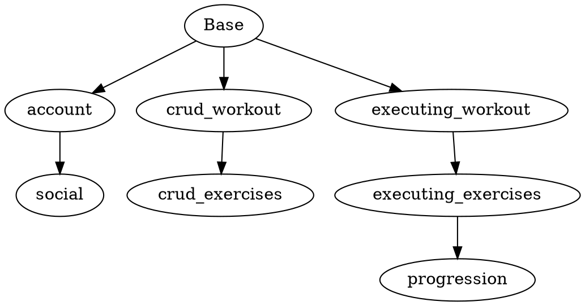

## Resources:

* https://github.com/KevinAst/feature-u
    - feature-u (update last 2020)
* https://feature-u.js.org/cur/presentation.html#presentation-syllabus
    - React native supported
    - Dynamic, it doesn't reduce the binary size, but it enables/disables features at runtime.
* Fitness mobile app (React native) (Source: https://github.com/tbolwerk/Totoro)
    - Advantage of the dynamic approach is that business opertunities, like customers are willing to pay for feature A can be put after a pay wall after release.
    - Another advantage would be that the app could be installed in a gym in a controlled manner which only shows workouts and not account information.
    - Another interesting look at how features can be structured for a real product in a more business/feature oriented manner.

