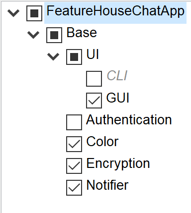

# Test report
This report will go over three variants which were manually tested for the Feature house implementation of the ChatApp.

## Variant a
### Feature set

### Image

### Result
Variant a works as intended.

## Variant b
### Feature set

### Image

### Result
Variant b works as intended.

## Variant c
### Feature set

### Image

### Result
Variant c works as intended.